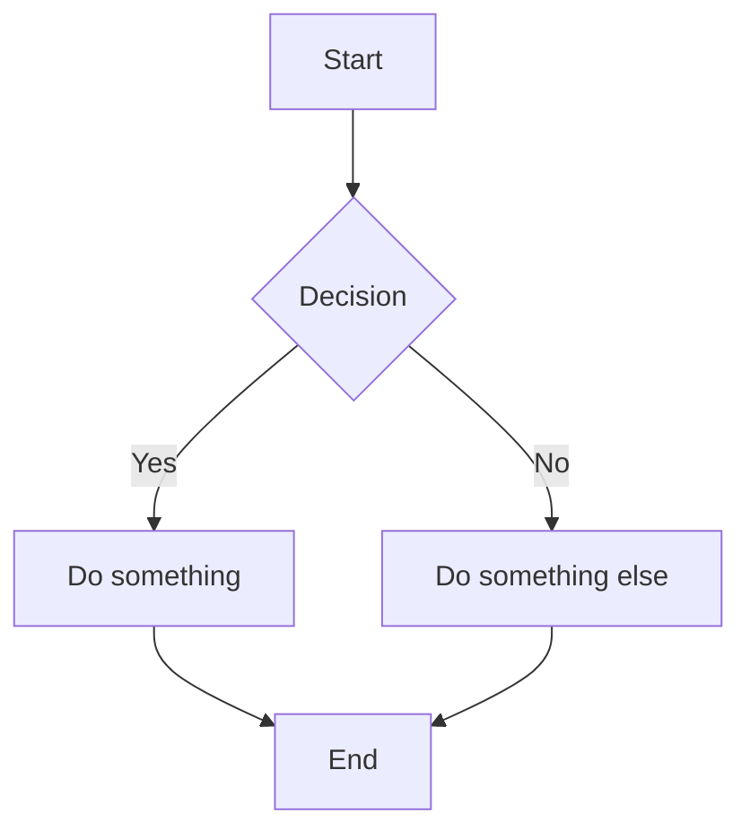
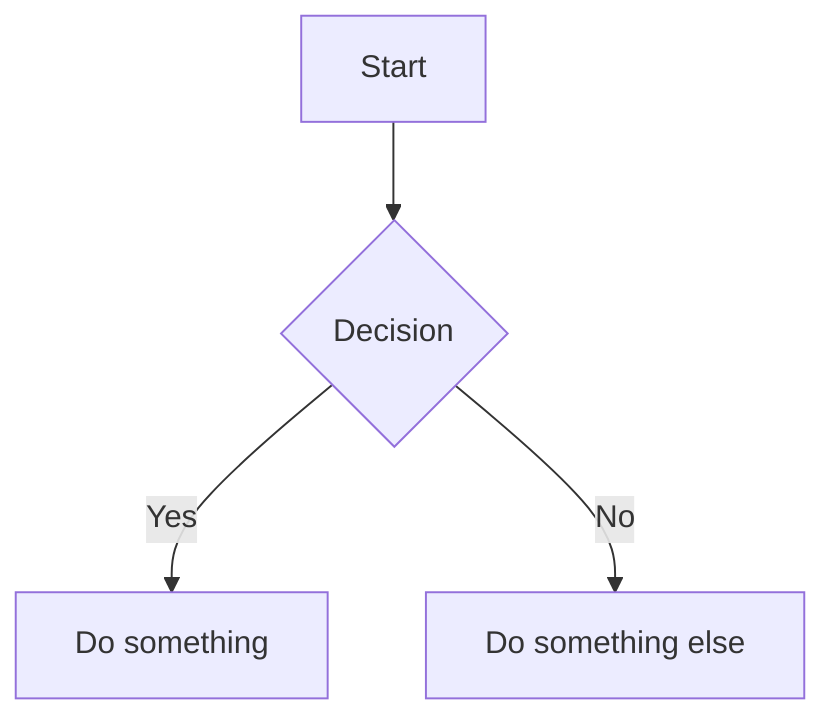
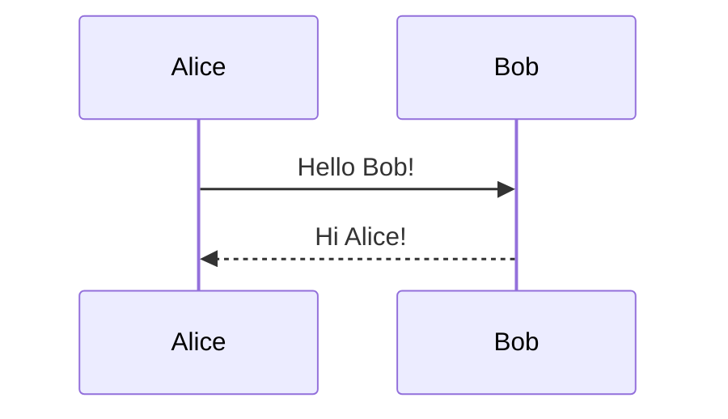
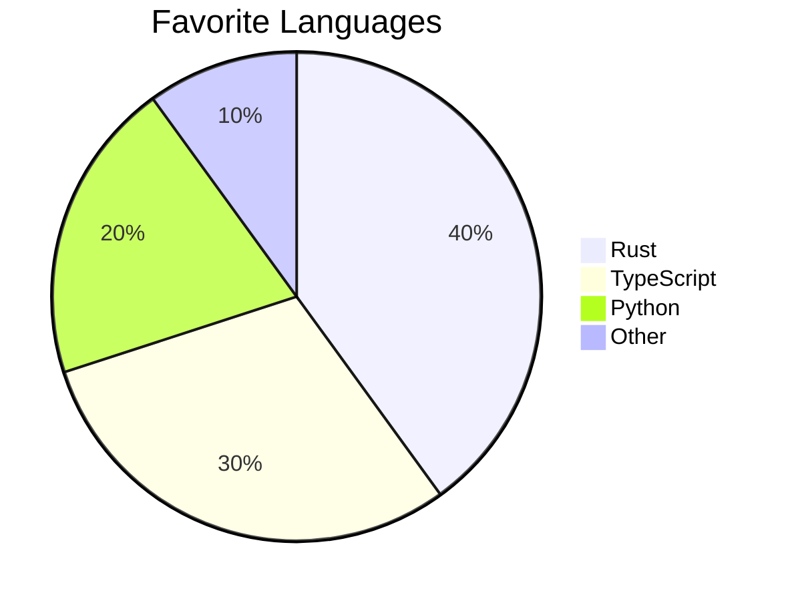

# Mermaid Diagrams

guidebook has built-in support for [Mermaid](https://mermaid.js.org/) diagrams.

## Usage

Use a `mermaid` code block:

~~~markdown

~~~

## Examples

### Flowchart



### Sequence Diagram



### Pie Chart



## Disable Mermaid

If you don't need Mermaid support:

```json
{
    "plugins": ["-mermaid-md-adoc"]
}
```
