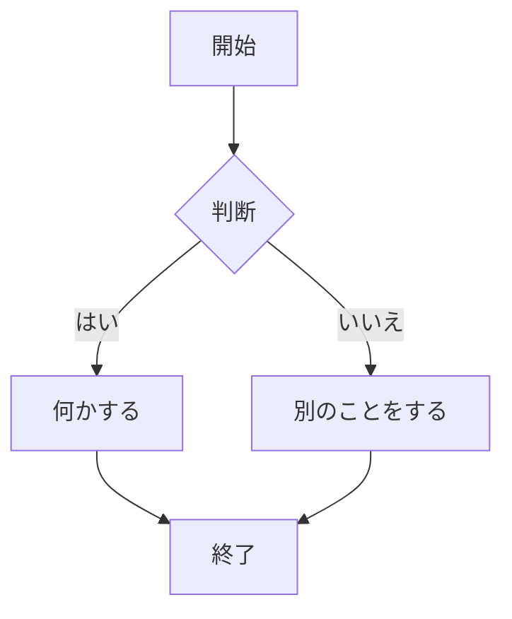
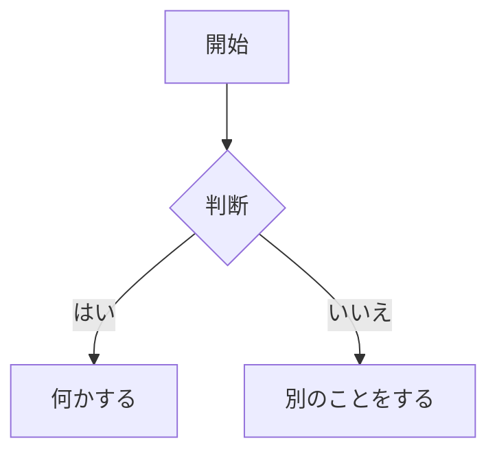
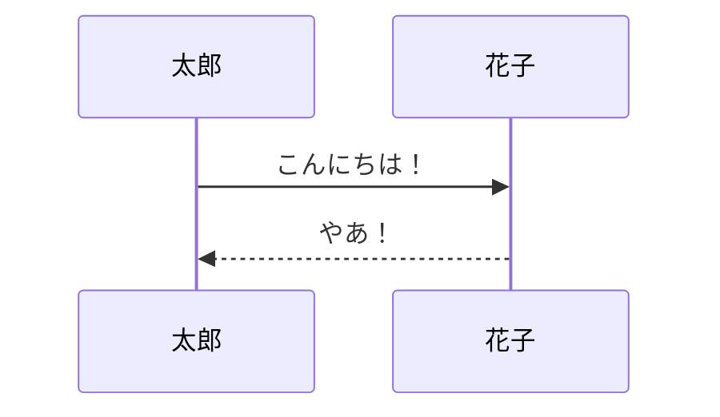
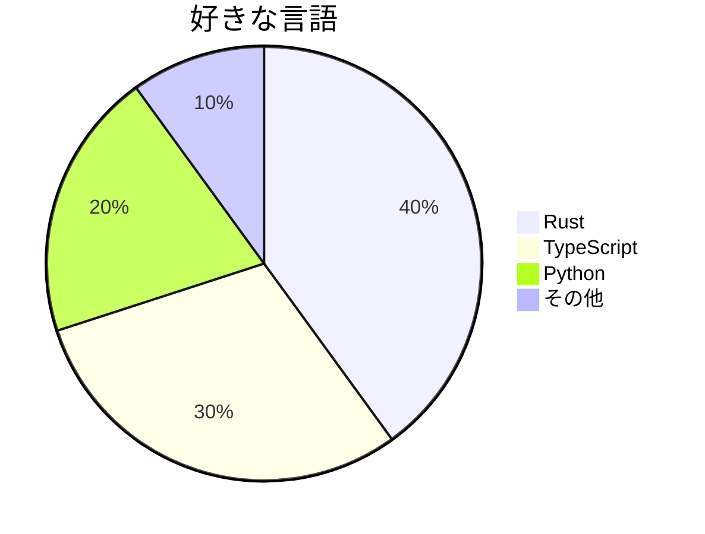

# Mermaid 図

guidebook は [Mermaid](https://mermaid.js.org/) 図を組み込みでサポートしています。

## 使い方

`mermaid` コードブロックを使用：

~~~markdown

~~~

## 例

### フローチャート



### シーケンス図



### 円グラフ



## Mermaid を無効化

Mermaid サポートが不要な場合：

```json
{
    "plugins": ["-mermaid-md-adoc"]
}
```
