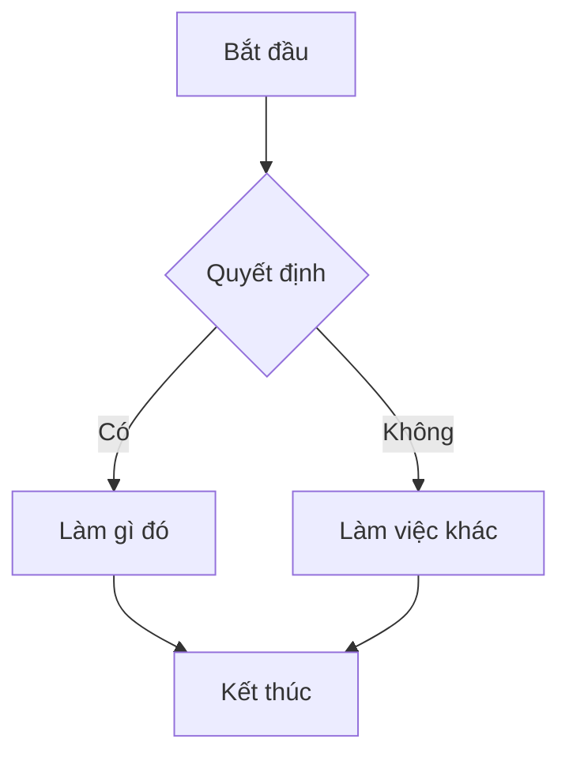
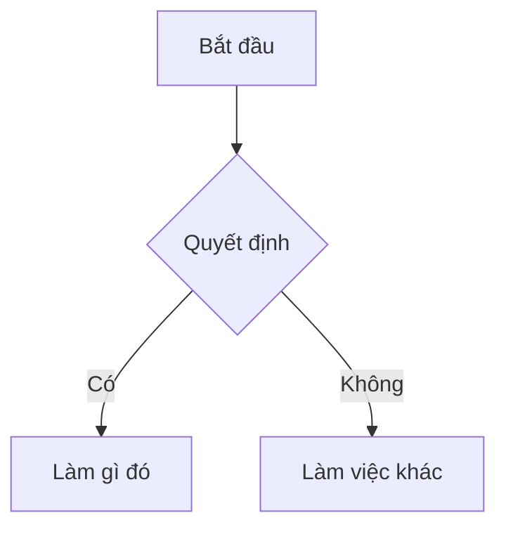
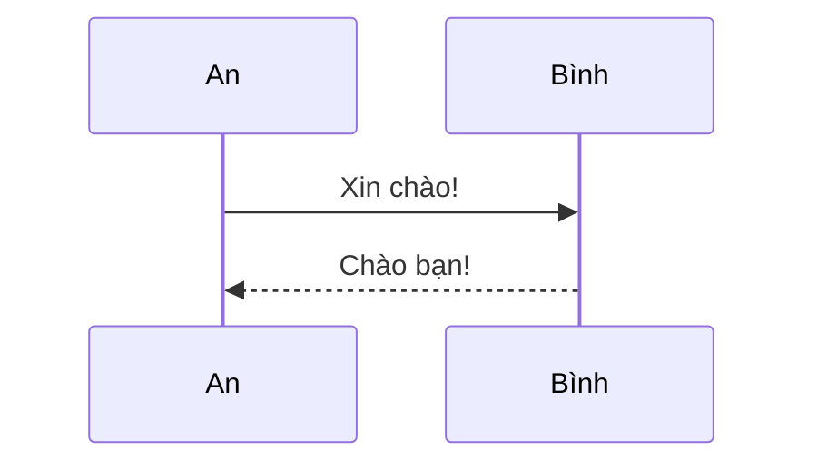
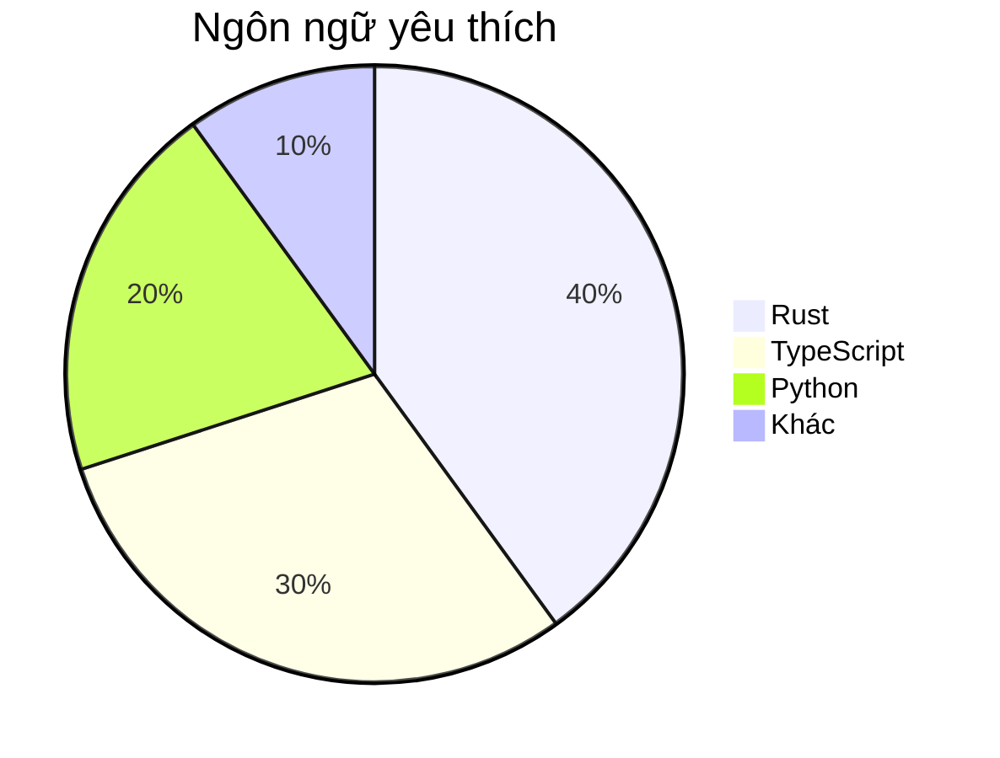

# Biểu đồ Mermaid

guidebook hỗ trợ tích hợp sẵn biểu đồ [Mermaid](https://mermaid.js.org/).

## Cách sử dụng

Sử dụng code block `mermaid`:

~~~markdown

~~~

## Ví dụ

### Flowchart



### Sequence Diagram



### Pie Chart



## Tắt Mermaid

Nếu không cần hỗ trợ Mermaid:

```json
{
    "plugins": ["-mermaid-md-adoc"]
}
```
